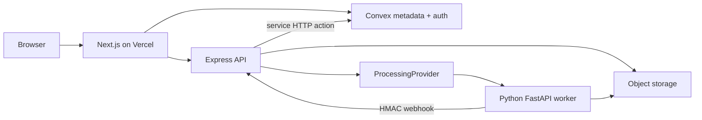

# PixelForge

Professional image and video restoration platform.

Not a toy editor. Not an “AI magic” landing page. PixelForge is a multi-service workspace: Next.js on Vercel, an Express API gateway, Convex metadata, private object storage, and a Python worker that runs OpenCV, Pillow, FFmpeg, Real-ESRGAN, and GFPGAN.


**Restore the detail your images lost.**

## Features

| Tool | Implementation |
| --- | --- |
| Image upscale 1×/2×/4× | Real-ESRGAN when weights exist; Lanczos when you select it |
| Photo restoration | Light / Balanced / Strong classical presets, optional GFPGAN |
| Face restoration | GFPGAN v1.4. Zero faces → `NO_FACES_DETECTED` |
| Background removal | BiRefNet (MIT) preferred, U²-Net (Apache 2.0) fallback. BRIA RMBG is **not** shipped |
| Cleanup / sharpen / denoise / color | OpenCV + Pillow, named as classical processing |
| Convert / compress | JPG, PNG, WebP, AVIF |
| Video denoise, sharpen, stabilize, convert, compress, thumbnails | FFmpeg argument arrays, audio copied where applicable |
| Video AI upscale | Requires GPU worker; otherwise FFmpeg scale if you choose it |
| Frame interpolation | Coming soon — never duplicated frames |

Landing comparisons are labeled **Sample** or **Preprocessed**. They are not live GFPGAN runs.

## Architecture



Heavy PyTorch / GFPGAN / FFmpeg jobs never run inside Vercel request handlers.

`ProcessingProvider` adapters: `local` · `replicate` · `gpu-worker` · `mock`

## Tech stack

- Next.js App Router, TypeScript, Vercel
- Express, Pino, Zod, AWS SDK v3 (S3-compatible)
- Convex (+ Convex Auth password provider)
- FastAPI, Pillow, OpenCV, FFmpeg, optional PyTorch / GFPGAN / Real-ESRGAN / rembg
- MinIO for local object storage

## Project structure

```
pixel-forge/
  apps/web          Next.js
  apps/api          Express gateway
  services/processor  FastAPI worker
  packages/types
  packages/shared
  packages/config
  convex/
  docs/
  docker-compose.yml
```

## Local development

Frontend-only (landing, docs, labeled demos):

```bash
cd pixel-forge
npm install
npm run dev
```

Full stack:

1. `docker compose up -d` — MinIO on :9000
2. Copy `.env.example` to `apps/web/.env.local`, `apps/api/.env`, `services/processor/.env`
3. `npx convex dev` (from the repo root after `npm exec convex login`)
4. `node scripts/generate-auth-keys.mjs` and paste `JWT_PRIVATE_KEY` + `JWKS` into the Convex dashboard
5. `npx convex env set API_SERVICE_SECRET <same as PROCESSING_WEBHOOK_SECRET>`
6. `npm run dev:api`
7. Python 3.11 or 3.12: `pip install -e services/processor`
8. `npm run dev:processor`
9. Optional GPU extras: `pip install -e "services/processor[gpu,onnx]"`

FFmpeg must be on `PATH` for video tools.

## Environment variables

See `.env.example`. Never commit `.env`. Object storage secrets belong only on the Node API. The Python worker receives signed URLs.

## Convex setup

Schema lives in `convex/schema.ts` and includes Convex Auth `authTables`. Every job and file row is keyed by `userId`. Admin queries require `profiles.role === "admin"`.

## Object storage

S3-compatible. Local: MinIO. Production: Cloudflare R2, AWS S3, or another S3 API. Uploads use randomized object keys. Downloads are short-lived signed URLs.

## GPU / production worker

Deploy `services/processor/Dockerfile` to a GPU host (Modal, RunPod, a VM). Set `PROCESSING_PROVIDER=gpu-worker` and `PROCESSING_PROVIDER_URL` on the API. The UI does not know which adapter ran.

## Testing

Run everything from the repo root:

```bash
npm run test:all
```

That script lives at `scripts/test-all.mjs` (PowerShell wrapper: `scripts/test-all.ps1`). It checks landing PNGs, then:

| Suite | Where | Command |
| --- | --- | --- |
| Sample media | `apps/web/public/samples/*.jpg` | JPEG signature + size |
| Web | `apps/web/src/lib/*.test.ts` | `npm run test --workspace=@pixelforge/web` |
| API | `apps/api/src/routes.test.ts` | `npm run test --workspace=@pixelforge/api` |
| Processor | `services/processor/tests/` | `pytest` via Python 3.11/3.12 |

Regenerate landing comparisons if those PNGs are missing:

```bash
# Synthetic charts (offline)
npm run generate:samples
# High-res Unsplash photos for landing comparisons (~4K masters)
npm run fetch:samples
```

### End-to-end (Playwright)

```bash
npx playwright install chromium
npm run test:e2e
```

Specs live in `tests/e2e/`. Fixtures in `tests/fixtures/`. Config: `tests/playwright.config.ts`.

SEO checks (`seo.spec.ts`) run against the marketing site without Convex. Full upload → process → download flows need Convex + API + worker; those specs assert honest gated UI until that stack is online.

## Deployment

- **Web:** Vercel project rooted at `apps/web` (or this monorepo with the web workspace). Set `NEXT_PUBLIC_CONVEX_URL` and `NEXT_PUBLIC_API_BASE_URL`.
- **API:** Container from `apps/api/Dockerfile`.
- **Worker:** Container from `services/processor/Dockerfile` on a machine with FFmpeg; add CUDA for GFPGAN/Real-ESRGAN.

## Security

- MIME + magic-byte validation; decompression-bomb guard
- No filesystem paths exposed
- FFmpeg via `create_subprocess_exec` argument lists
- Webhook HMAC (`x-pixelforge-signature`)
- Cross-user Convex filters on every query
- No secrets in the client bundle

## File retention

24h / 7d / 30d. Hourly Convex cron marks expired files deleted. The API can then remove objects. Users can delete a history row and its objects immediately.

## Model licenses

Documented in [docs/licenses.md](docs/licenses.md) and `/legal/licenses`. GFPGAN is Apache 2.0 with a NVIDIA StyleGAN2 third-party caveat. BRIA RMBG is excluded.

## Troubleshooting

| Symptom | Check |
| --- | --- |
| Landing works, jobs fail | API + worker + MinIO running; `PROCESSING_PROVIDER_URL` |
| `MODEL_UNAVAILABLE` | Install `[gpu]` extras and allow model download |
| `NO_FACES_DETECTED` | Use restore/upscale instead of face restoration |
| `INTERPOLATION_UNAVAILABLE` | Expected until a licensed interpolator is configured |
| Convex auth loops | `JWT_PRIVATE_KEY`, `JWKS`, `SITE_URL` |

## Roadmap

- Licensed frame interpolation adapter
- Contact-sheet best-frame scoring
- Team plan + Stripe (usage service is already plan-shaped)
- Optional Modal/RunPod deploy templates

## License

Apache-2.0 for PixelForge application code. Upstream models keep their own terms.
